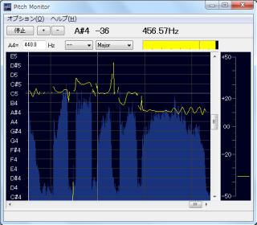

：话说... UTAU 居然已经 13 年了吗　（同时也停更 7 年了，悲

>推荐先阅读 [UTAU 调声喵手记](/post/nyaanote/utau/1) 以获得更佳的阅读体验

咳咳，咱来兑现承诺了（

*：“这个兑现的时间有些太长了吧喂！”*

但这次是真的心得技巧了，不是上一篇那样的只是列出来一堆软件的伪·喵手记了喵！

姆，该开始正文了（

在开始之前，首先需要搞明白人们所要的良好歌声是什么样的...？

咱根据常识也至少能知道它不会是将每一个音符都完全唱准，没有一丝波动的死板的歌声哦

因为人类歌唱时不会“完美”的唱准每一个音符，而是会在此基础上波动，而且音量/气息等也会随着情感变化。调教歌声合成引擎来歌唱，根本上还是需要人去量化自己的唱腔并赋予到“虚拟歌手”上来。对于人来讲，歌唱是情感的抒发，去量化这样一个高度随机且复杂的行为应该会比较困难。故咱在此推荐一个前文已经提到了工具（只是没有详细的讲解），即是：

## Pitch Monitor！

它的功能如前文所述：

>可以通过麦克风录音来分析音高，适用于不知道对音高参数没有概念但本身有一定歌唱功底或大致有音高参数概念但没有歌唱功底的人类，后者可以通过这个软件了解人类一般歌唱时会出现的转音/长音特征和缺陷，可以学习如何使歌声更加拟合人类歌唱效果

具体来看嘛...长这个样子：

要使用的话，先熟悉一下它的界面吧：

菜单栏内的东西是一些设置，基本不用动。下方的按钮按从左到右顺序分别为：

- 菜单栏下第一行
    - 开始/停止
    - 放大钢琴窗
    - 缩小钢琴窗
    - 音高指示器（分析鼠标所指处的音高）
    - 频率指示器（同上，不过以频率形式呈现）
- 第二行
    - 音高基准（一般不用动，如有需求可以调整它来改变音高与频率的映射基准）
    - Key 音指示器
    - 音量指示器
        - 其上仔细看会发现还有一条线，拖动以改变用于分析的最低音量，很多时候都需要调整这个界限

比较重要的是下方的钢琴窗，可以看到它指示着分析得到的音高。如有必要可以参考此处的音高调参（不推荐），接下来会用到它来从量化的角度来理解自己的歌声

## 歌声...与参数？

目前，歌声合成引擎一般还是一套*死板*的程序，它不能直接理解你的歌声，所以咱们需要喂给它一个谱子，还有量化歌声的参数。以 Vocaloid 的参数为例（其他引擎一般也具备以下要素，名词可能变化），应有以下几种：

A. 辅音速度（VEL） B. 气声（BRE）

C. 音高（PIT） D. 动态（DYN）

E. 明度（BRI） F. 性别值（GEN）

G. 开口度（OPE）

看起来十分抽象，不是吗？不过不要担心，先记住他们，尝试自己开口，不要紧张，随意地唱一下自己喜欢的歌曲或即兴一段。仔细地感受自己尝试弱化/加强力度与不同音高/情绪时的音色变化，并开启 Pitch Monitor 查看自己实时的音高曲线，仔细注意如上方参数的部分

为方便说明，咱就先说说自己的体验好了：

弱化力度时会有的倾向：

- 加快清辅音速度，缩短浊辅音所占时长
- 降低清辅音和鼻音音量
- 稍稍增加鼻音时长
- 弱起韵头、缩短甚至消除韵腹、加长韵尾

抒情时可能偏向于：

- 缩短清辅音，加长浊辅音与鼻音
- 弱起并加长韵头，缓慢增加音量至韵腹，缩短韵味，加重语尾息音
- 波动的音高

另外在长段、高潮段前、抒情段前/中部会有深呼吸/较长的呼吸音

不过嘛......各人的唱法不同，和上面的记录有出入是相当正常的事。请务必以自己的感觉为准，需要记住是你赋予虚拟歌手情感，而不是别人。自己的感受是非常重要的！

在此提供一个大致的方向，可以根据它多多尝试：

- 音色应变粗时、音高低感觉不自然时推荐降低性别值（或说偏向粗重的音色）

- 抒情时调高辅音速度，调整动态音量（UTAU 的话需要依赖后期，推荐 VocalShifter），增加颤音幅度，平缓地升高/降低音调。并适当增加插入呼吸音的频率

- 音高高时可以增加明度与气声参量，加快辅音速度，稍稍增加辅音音量。适当应用抒情部分的调教方法（如波动音高、弱起元音等）

- 如果要缓和用力过度（甚至是掐嗓子）的感觉推荐增加气声的含量（一般引擎增加b的值，mores增加Mb的值）并降低辅音音量（同样需要后期），这种方法也通用于各种需要弱化力度的场景

- 以咱自己的习惯来讲因为容易和四声调产生不良的联系，一般非特殊唱腔不会在汉语的韵腹增加长转音。

总之各人对于唱法的偏好不同，本文也不可能全部覆盖。如果想要真正入门调教还是要多加练习（无论是实际的歌唱还是合成的技巧），没有所谓的“速成”方法可选。

（另外，不要闭门造车。平时在听自己喜欢的曲目时多跟着唱一唱，多感受一下歌手声音的细节，多看大佬的调声晒、直播等也都是非常好的提高技巧

以上

*：“你不觉得这篇文章有点水吗？”*

*hmm...就像声乐别人不可能帮你练习一样，三十一天速成指南那样的东西怎么可能写的出来啊啊啊（逃*
